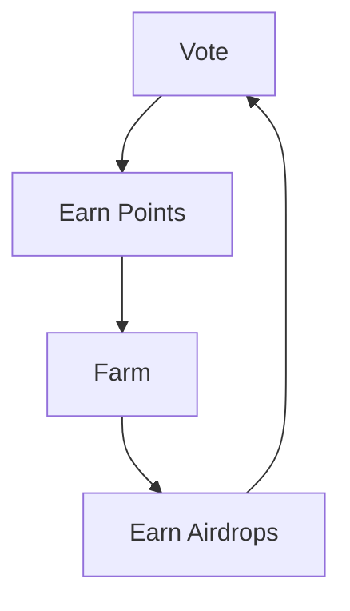
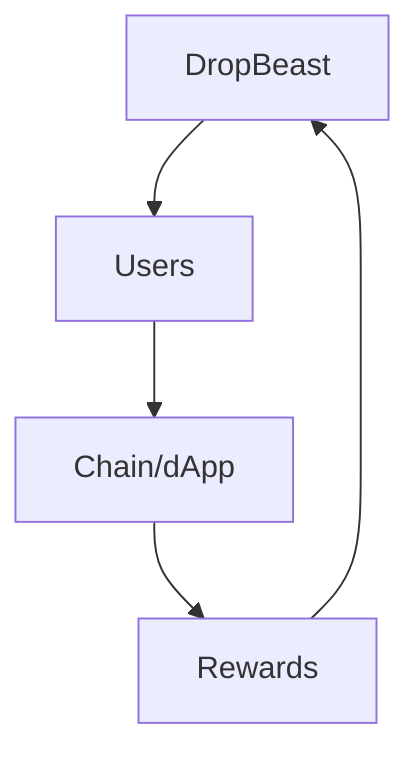

# BEAST: Community-Driven Airdrop & Liquidity Platform

## Platform Information
**Type**: Permissionless Community Platform
**Focus**: Airdrop & Liquidity Automation
**Launch**: Coming Soon
**Website**: dropbeast.xyz

  # BEAST Ecosystem TL;DR:

DropBeast becomes community ran;

- Problem: $30B+ in airdrops, but inefficient for both users and protocols  
- Solution: Community Decision Making on-top of an excellent foundation (The current DropBeast Product)
- Mechanism: Users stake $BEAST → Vote on integrations → Tokens burn → Product Value Accrues  
- Result: Token & Product Capture Value  
- Think "Decentralised Marketplace for Liquidity Opportunities" rather than "Airdrop Tool"
  
  ### The First Community-Aligned Automation Platform

<table align="center" style="background: linear-gradient(145deg, #1a1a1a, #2a2a2a); border-radius: 10px; width: 600px;">
<tr>
<td align="left" style="padding: 20px;">

🏛️ Community Governance
🔄 Automated Farming
💎 Value Alignment

</td>
</tr>
</table>

---

# BEAST Token Proposed Ecosystem Overview

BEAST is a community-driven, permissionless platform that bridges the gap between individuals and infrastructure projects. We're not framing ourselves as airdrop farming experts - we're the connection between scarce user resources and providing optimal avenues for liquidity.

## The Narrative & Future of Airdrops

The first community-aligned and democratized automation platform.

Airdrops exist because infrastructure projects are competing to secure a scarce resource - users. To overcome this challenge, loyalty programs and rewards are offered to incentivise user adoption. With over [$30b](https://www.coingecko.com/research/publications/biggest-crypto-airdrops) in airdrops distributed since 2023, the opportunity is massive but currently inefficient. 

There's plenty of reasons for these programs to exist; users provide activity, liquidity, stress-testing, scalability testing, transaction fees to fund validators & teams and in-exchange there is the potential to receive rewards.

However, the market is extremely inefficient:
- Users spend excessive time and resources on speculation  
- Protocols struggle to effectively reach their objectives  
- No alignment between users and protocols  
- Security risks in manual farming

The goal is to bridge the gap between individuals and infrastructure projects, to ensure that both sides capture as much value as possible.

## Core Objectives

### 1. Automate Access to Incentive Programs

DropBeast will remain an automation platform for users to automate on-chain activity. DropBeast users can increase their likelihood of gaining a portion of the rewards distributed via airdrop campaigns through the use of the DropBeast Platform. 

The $BEAST Token democratizes access to the DropBeast Platform. Users stake lock their tokens to get access to the platform and contribute to the direction via a voting mechanism discussed below.

DropBeast will remove friction for scaling access across numerous protocols, saving time while maximising value. 

### 2. Provide Value Through Community Alignment

Proposals & Votes will take place to assist in providing direction to the development team to build out the necessary integrations & technology. 

The objective is for all those committed to DropBeast to work towards to maximize the value of the platform.

- Holders of the $BEAST Token can put forward a proposal, and commit tokens to a vote that will act as a bounty system to complete new integrations, feature enhancements, strategies, bug fixes and hiring of employees for the decentralised $BEAST entity.   
- There will be no central authority controlled decisions.  
- Transparent voting will be weighted by $BEAST Holdings.

As an example; During a BEAR Market, users may seek to optimise stable coin yields and vote on those integrations. The opportunities are endless for integrations, with the foundation that DropBeast has built to date. 

**Why vote? No votes = no value increase.**

### 3. Scaling DropBeast to Resolve Market Inefficiencies

As more opportunities are supported, more users become involved in the DropBeast value alignment.   

As a result, DropBeast transitions into a user base that provides value to two parties:
a) The DropBeast community shares knowledge which provides strategic & research alignment
b) The DropBeast Community holds weight in regards to engaged user metrics as fee-paying wallets which results in on-chain activity such as Volume, Liquidity, TVL. These metrics are essential for chains & dApps, this is where things get interesting for the growth of DropBeast.

New Chains & dApps utilize airdrop rewards primarily as a marketing tool to attract a new user base that fulfills specific goals (such as TVL). 

As DropBeast grows we believe infrastructure projects will **seek direct connection** to the user-base of DropBeast. DropBeast will scale access for users to become involved in more opportunities than what is manually achievable.

New Protocols can essentially **bribe DropBeast users** to facilitate liquidity deployments onto platforms which will enable testing and growth for the parties.

Giving out rewards also provide chains and dApps with value such as volume, liquidity, and activity, serving as a powerful validation tool in the market.  
     
This vision essentially resolves the inefficiencies of the airdrop market as the engagement becomes symbiotic and directly achieves key objectives. 

### 4. Align Value Between Communities, dApps & Chains

Utilising our democratic voting mechanism, and user base DropBeast can become the middle-man between users and protocols. 

It may become essential for protocols to support DropBeast and the users of the DropBeast Platform to create maximum value for their rewards campaign as they transition into product growth. 

As a result, we can theorise that users are incentivised to provide greater support to shaping the direction of said campaigns and in-exchange align with the reward structure of the protocol. 

In theory, both sides are able to strategically align, creating more value for both parties instead of relying on the current speculative & detrimental approaches for user acquisition, farming and post-launch contingency.

In short, DropBeast belongs to the community, we're not framing ourselves as airdrop farming experts… we're the connection between a scarce resource in users & the fight for liquidity to enable product growth on the market. 

We are providing access to an incentive program for our users, while ensuring alignment with the chain.

## The New Meta Token of the Airdrop Market: $BEAST

There are two questions:
- The question that users ask: "How do I access this opportunity securely and in an efficient manner?"
- The question that chains & apps ask: "How do we win this fight for liquidity & users?"

### The New Meta is Fundamentally Different

The airdrop market is speculation, speculation is an extremely productive form of marketing in the space.

Speculation results in users completing activities they believe are correct to receive an unconfirmed reward. As a result, people are spending copious amounts of time, money and exposing themselves to security issues. 

Chains & dApps so far are happy with this approach, because speculation = users, users = liquidity, activity, fees, social proof, Validation of Product-market-fit, and demand for their Token-Generation-Event. Therefore, they are more than happy to distribute rewards and play into the speculative nature of these marketing campaigns to win the battle for liquidity, and secure the most scarce resource in the space... users.

We cannot see this process being replaced anytime soon, if you believe the space to be growing then the fight for users won't cease. 

We've now established that a market exists and is ready to scale, but how can we make the entire process more valuable? 

### Known Facts:
- Individuals & Communities are already farming en masse
- Numerous Chains & dApps are running incentive programs
- Almost every single incentive program is speculative in nature, meaning users don't know how to qualify and chains don't effectively reach their objectives

### A Hypothetical:

**Q:** Would it benefit protocols & users to understand the goals of each party involved in an incentive program? 

**A:** If DropBeast can work directly with a protocol to create an understanding, such as an objective for trading volume. DropBeast can start their incentive campaign with 100,000 daily transactions, 1m in TVL & 10,000 active wallets; both parties would reach their maximum extractable value with reduced friction.

Once we identified this we shifted our stance from having a private automation tool to a community aligned ecosystem. DropBeast believes we can shift the narrative from user vs project to user & project. 

We want everyone to win, and not sabotage this wonderful incentive program adopted by many. 

DropBeast can unlock more value for all parties involved, and as a result become the meta token for airdrop farming. 

The objective for DropBeast then becomes how do we grow as much as possible to realize this vision?

The answer is to implement our very own innovation, a **Farm to Farm** mechanism. Grind for rewards on DropBeast, which turn into platform rewards that can be utilised to access more opportunities. This cycle turns into an incentivised user-base ready to shape the future of DropBeast, while providing protocols with exactly what they need for any given scenario. 

  
"Knowledge is power."

