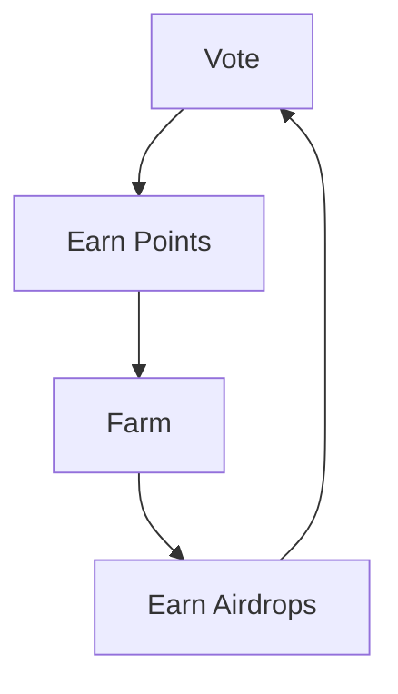
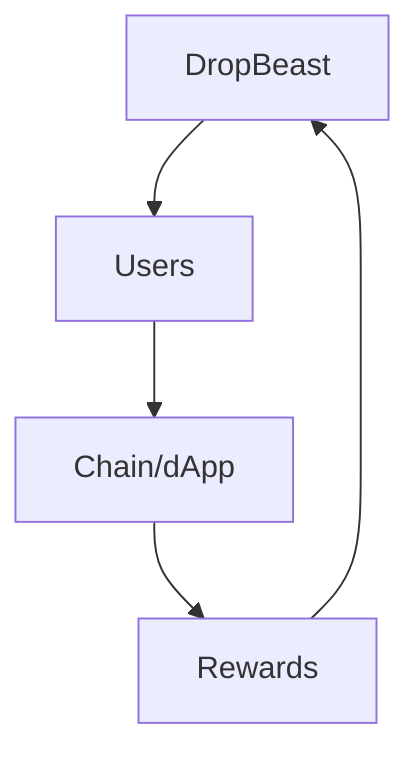

# BEAST: Community-Driven Airdrop & Liquidity Platform

[](https://dropbeast.xyz)
[](https://dropbeast.xyz)
[](https://dropbeast.xyz)

## Platform Information
**Type**: Permissionless Community Platform
**Focus**: Airdrop & Liquidity Automation
**Launch**: Coming Soon
**Website**: dropbeast.xyz

<div align="center">

  # BEAST Ecosystem TL;DR:

<div align="left">
DropBeast becomes community ran;

- Problem: $30B+ in airdrops, but inefficient for both users and protocols.  Expensive to develop due to complex airdrop requirements, Speculation means inefficient development.
- Solution: Community decision making on-top of an excellent foundation (The current DropBeast Product).
- Mechanism: Users stake $BEAST → Vote on integrations → Tokens burn → Product Value Accrues  
- Result: Token & Product Capture Value  
- Think "Decentralised Marketplace for Liquidity Opportunities" rather than "Airdrop Tool"

## Token Economy

  
  ### The First Community-Aligned Automation Platform
</div>

<table align="center" style="background: linear-gradient(145deg, #1a1a1a, #2a2a2a); border-radius: 10px; width: 600px;">
<tr>
<td align="left" style="padding: 20px;">

<div style="display: flex; justify-content: space-between; margin: 20px 0;">
<span>🏛️ Community Governance</span>
<span>🔄 Automated Farming</span>
<span>💎 Value Alignment</span>
</div>


</td>
</tr>
</table>

---
<div align="left">

# Introduction; 

Problem:
- Liquidity is the lifeblood of Web3, it’s a scarce and critical resource. 
- Protocols offer various programs to attract Liquidity 
- Participating in these programs is difficult for liquidity providers because effort level and opportunity costs are high 
- Solution: DropBeast maximises access to rewards while minimising effort.
- DropBeast introduces an innovative approach to airdrop farming, designed to simplify the process, maximise returns, and enhance user experience. 

DropBeast makes it easy for liquidity providers to find and participate in protocol reward programs by surfacing the best opportunities and automating key processes to maximise returns. 

# BEAST Token Proposed Ecosystem Overview

BEAST is a community-driven, permissionless platform that bridges the gap between individuals and infrastructure projects. We're not framing ourselves as airdrop farming experts - we're the connection between scarce user resources and providing optimal avenues for liquidity.

## The Narrative & Future of Airdrops

The first community-aligned and democratized automation platform.

Airdrops exist because infrastructure projects are competing to secure a scarce resource - users. To overcome this challenge, loyalty programs and rewards are offered to incentivise user adoption. With over [$30b](https://www.coingecko.com/research/publications/biggest-crypto-airdrops) in airdrops distributed since 2023, the opportunity is massive but currently inefficient. 

There's plenty of reasons for these programs to exist; users provide activity, liquidity, stress-testing, scalability testing, transaction fees to fund validators & teams and in-exchange there is the potential to receive rewards.

Users are always going to be deciding where to allocate their liquidity, and in theory it then becomes optimial to allow a democratic system to shape the direction of DropBeast to automate said liquidity deployments. 

<div align="left">

However, the market is extremely inefficient:
- Users spend excessive time and resources on speculation  
- Protocols struggle to effectively reach their objectives  
- No alignment between users and protocols  
- Security risks in manual farming

The goal is to bridge the gap between individuals and infrastructure projects, to ensure that both sides capture as much value as possible.

In short, Users know where they want to deploy liquidity to, and protocols know what they need from users. This can be a symbiotic relationship in the future.

## Core Objectives

### 1. Automate Access to Incentive Programs

DropBeast will remain an automation platform for users to automate on-chain activity. DropBeast users can increase their likelihood of gaining a portion of the rewards distributed via airdrop campaigns through the use of the DropBeast Platform. 

Examples of votes: 
- Expand the Meteora DLMM Process to automate specific strategies
- Introduce Algorithmic Trading for specific coins via Jupiter
- Integrate Various Airdrops on SUI
- Integrate Monad for the TestNet Opportunity 
- Introduce Staking to users must stake to access the platform
- Introduce a FIAT Onramp that actions token buy-backs
- Hire a Support Lead to assist all community members
- Hire a designated developer to QA all Code Submissions (Bounty Submissions)
- Change the voting process, as an example; make it cost a specific amount of tokens to make a proposal

The $BEAST Token democratizes access to the DropBeast Platform. Users stake lock their tokens to get access to the platform and contribute to the direction via a voting mechanism discussed below.

DropBeast will remove friction for scaling access across numerous protocols, saving time while maximising value. 

### 2. Provide Value Through Community Alignment / Open Source

Proposals & Votes will take place to assist in providing direction to the development team to build out the necessary integrations & technology. 

There's two options here; 
1. Open Source the product and allow any community developer to submit for a bounty, with a designated internal or external developer who will approve said submission.
2. Do not open source, and have the DropBeast team nominate a developer for each proposal that is passed.

The objective is for all those committed to DropBeast to work towards to maximize the value of the platform.

- Holders of the $BEAST Token can put forward a proposal, and commit tokens to a vote that will act as a bounty system to complete new integrations, feature enhancements, strategies, bug fixes and hiring of employees for the decentralised $BEAST entity.
- There will be no central authority controlled decisions.  
- Transparent voting will be weighted by $BEAST Holdings.

As an example; During a BEAR Market, users may seek to optimise stable coin yields and vote on those integrations. The opportunities are endless for integrations, with the foundation that DropBeast has built to date. 

**Why vote? No votes = no value increase.**



### 3. Scaling DropBeast to Resolve Market Inefficiencies

As DropBeast reaches critical mass and becomes a trusted source of liquidity acquisition and deployment, its network effect and reach will become extremely valuable to protocols wanting to attract liquidity. DropBeast’s ability to integrate deeply with protocols will allow all liquidity providers to get value out of automating tasks by maximising their returns which results in developing long-term stickiness.

As a result, DropBeast transitions into a user base that provides value to two parties:
a) The DropBeast community shares knowledge which provides strategic & research alignment
b) The DropBeast Community holds weight in regards to engaged user metrics as fee-paying wallets which results in on-chain activity such as Volume, Liquidity, TVL. These metrics are essential for chains & dApps, this is where things get interesting for the growth of DropBeast.

New Chains & dApps utilize airdrop rewards primarily as a marketing tool to attract a new user base that fulfills specific goals (such as TVL). 

As DropBeast grows we believe infrastructure projects will **seek direct connection** to the user-base of DropBeast. DropBeast will scale access for users to become involved in more opportunities than what is manually achievable.

New Protocols can essentially **bribe DropBeast users** to facilitate liquidity deployments onto platforms which will enable testing and growth for the parties.

Giving out rewards also provide chains and dApps with value such as volume, liquidity, and activity, serving as a powerful validation tool in the market.  
     
This vision essentially resolves the inefficiencies of the airdrop market as the engagement becomes symbiotic and directly achieves key objectives. 

### 4. Align Value Between Communities, dApps & Chains

Utilising our democratic voting mechanism, and user base DropBeast can become the middle-man between users and protocols. 

It may become essential for protocols to support DropBeast and the users of the DropBeast Platform to create maximum value for their rewards campaign as they transition into product growth. 

As a result, we can theorise that users are incentivised to provide greater support to shaping the direction of said campaigns and in-exchange align with the reward structure of the protocol. 

In theory, both sides are able to strategically align, creating more value for both parties instead of relying on the current speculative & detrimental approaches for user acquisition, farming and post-launch contingency.

In short, DropBeast belongs to the community, we're not framing ourselves as airdrop farming experts… we're the connection between a scarce resource in users & the fight for liquidity to enable product growth on the market. 

We are providing access to an incentive program for our users, while ensuring alignment with the chain.

Summary:
- DropBeast unlocks access to liquidity for protocols by maximising access to rewards and minimising effort for liquidity providers. 
- The platform's long-term vision includes evolving beyond airdrop farming to provide a wider range of tooling for both liquidity growth, and returns maximisation. 


## The New Meta Token of the Airdrop Market: $BEAST

There are two questions:
- The question that users ask: "How do I access this opportunity securely and in an efficient manner?"
- The question that chains & apps ask: "How do we win this fight for liquidity & users?"

### The New Meta is Fundamentally Different

The airdrop market is speculation, speculation is an extremely productive form of marketing in the space.

Speculation results in users completing activities they believe are correct to receive an unconfirmed reward. As a result, people are spending copious amounts of time, money and exposing themselves to security issues. 

Chains & dApps so far are happy with this approach, because speculation = users, users = liquidity, activity, fees, social proof, Validation of Product-market-fit, and demand for their Token-Generation-Event. Therefore, they are more than happy to distribute rewards and play into the speculative nature of these marketing campaigns to win the battle for liquidity, and secure the most scarce resource in the space... users.

We cannot see this process being replaced anytime soon, if you believe the space to be growing then the fight for users won't cease. 

We've now established that a market exists and is ready to scale, but how can we make the entire process more valuable? 

### Known Facts:
- Individuals & Communities are already farming en masse
- Numerous Chains & dApps are running incentive programs
- Almost every single incentive program is speculative in nature, meaning users don't know how to qualify and chains don't effectively reach their objectives

### A Hypothetical:

**Q:** Would it benefit protocols & users to understand the goals of each party involved in an incentive program? 

**A:** If DropBeast can work directly with a protocol to create an understanding, such as an objective for trading volume. DropBeast can start their incentive campaign with 100,000 daily transactions, 1m in TVL & 10,000 active wallets; both parties would reach their maximum extractable value with reduced friction.


Once we identified this we shifted our stance from having a private automation tool to a community aligned ecosystem. DropBeast believes we can shift the narrative from user vs project to user & project. 

We want everyone to win, and not sabotage this wonderful incentive program adopted by many. DropBeast can unlock more value for all parties involved, and as a result become the meta token for airdrop farming. 

The objective for DropBeast then becomes how do we grow as much as possible to realize this vision? The answer is to implement our very own innovation, a **Farm to Farm** mechanism. Grind for rewards on DropBeast, which turn into platform rewards that can be utilised to access more opportunities. This cycle turns into an incentivised user-base ready to shape the future of DropBeast, while providing protocols with exactly what they need for any given scenario. 

<div align="left">
  
# BEAST Token Staking & Governance

## Governance 

###  [While this section is directionally correct, the process will ultimately be up to the community ]

The BEAST Token governance model empowers the community to directly influence the strategic direction of BEAST through deciding which new networks or applications the platform supports. 

### Core Governance Process
The core of the governance process revolves around voting on proposals to integrate new networks or applications into the DropBeast platform. Decisions made through this process directly impact the range and nature of opportunities available to users, thereby shaping their potential airdrops and experiences.

### Token Voting Mechanisms
The BEAST token is critical to the voting process in the following ways:
- Can determine access to voting through staking, locking or burning
- Supply distribution and specific network can determine voting mechanism
- Voting executed through staked tokens

These mechanisms serve a dual purpose: aligning voting power with a demonstrated commitment to the platform, and it helps mitigate frivolous or non-committal voting behavior. The token stake acts as a representation of vested interest, ensuring that those who influence the platform's direction are also those who are substantively invested in its success.

## Access Mechanisms

Several mechanisms utilizing staking, locking, burning or a combination of BEAST tokens may be implemented to gate access to voting. 

The first possible mechanism is tiered voting power based on the staked amount of BEAST tokens. Here, the voting power is directly proportional to the number of tokens a participant stakes. To encourage long-term investment and reduce speculative behavior, a minimum staking duration is required for eligibility to vote. This approach aligns voting power with a vested interest in the platform.

Another method enhances voting rights for users who lock their tokens for predetermined periods. Longer lock-in periods result in higher voting power. This mechanism incentivizes users to commit to the platform for extended durations, promoting stability and reducing market volatility.

The third mechanism introduces the concept of burning tokens for increased voting influence on specific proposals. By burning a portion of their tokens, users can gain a significant, albeit temporary, increase in their voting power for a particular governance decision. This method allows users to demonstrate strong convictions regarding proposals but also results in a permanent decrease in their balance of $BEAST token units held.

Additionally, a cumulative voting power system rewards continuous stakers. Users who stake their tokens consistently over time accumulate additional voting sentiment power, fostering ongoing engagement with the ecosystem and rewarding sustained participation.

Finally, a mechanism for locked staking with a redemption penalty is employed. Participants can lock their tokens for voting rights but face a penalty if they choose to redeem their tokens before the end of the lock period. This penalty, partially burned and partially redistributed to remaining stakers, deters premature token redemption and ensures committed participation in the governance process.

These mechanisms collectively ensure that governance within the DropBeast ecosystem is both fair and representative, giving weight to those stakeholders who demonstrate a long-term commitment to the platform's success and stability.

The mechanisms allow for users to express the intensity of their preference, but at an increasing cost. This could be ideal for deciding on supporting emerging networks or applications where passion and long-term vision might be more important than sheer numbers. For example, a smaller group of highly committed users could influence the adoption of a cutting-edge but less-known application that they believe has significant future potential.

Weighted Voting Based on Time Staked: Votes are weighted by not only the amount of BEAST staked but also the length of time the tokens have been staked. Longer staking periods result in more voting power. This method can be useful when making decisions that impact the long-term direction of BEAST, such as adopting a new foundational technology or long-term partnership. It gives more influence to those who have demonstrated a long-term commitment to the ecosystem.

Single Transferable Vote (STV): In STV, voters rank their choices in order of preference. If their first choice doesn't win, or wins with more votes than needed, their vote is transferred to their next choice. This approach is beneficial for situations where there are multiple potential networks or applications to choose from, and it's important to reach a consensus that reflects the broadest possible preference of the community, rather than a simple majority for a single option.

Consensus Voting: Here, a proposal is accepted only if it achieves a very high percentage of votes (e.g., 75% or more). This approach is useful for major, irreversible decisions that will significantly affect the BEAST ecosystem, such as a radical change in the tokenomics or the integration of a network with substantially different principles or technology. Consensus voting ensures that such significant changes are made only with widespread agreement among stakeholders.

# Governance processes

When a proposal is put forward it will have a mechanism to participate (access) as well as to vote. The outcome of the vote is an indication of sentiment to us about  the next network or application that the DropBeast Application should support, guiding the platform's expansion and strategic partnerships.

The significance of this governance model extends beyond mere token utility. It embeds a democratic ethos into the heart of the BEAST ecosystem, fostering a sense of ownership and collective responsibility among its users. By enabling token holders the power of sentiment to more directly shape the platform's trajectory, BEAST not only democratizes the inputs to its decision-making but also cultivates a more engaged and dedicated community.

Plausible scenarios under this governance model could include a proposal to support a rising blockchain network renowned for its innovative smart contract capabilities, appealing to users eager for new farming landscapes. Another scenario might involve a vote on integrating a niche application that offers unique airdrop opportunities, catering to a segment of the community interested in diversifying their airdrop portfolio. In each case, the decision to support these new ventures would be made collectively by the community, reflecting a true synergy between the platform's capabilities and its users' aspirations.

## Implications on supply

Here's how each mechanism affects the supply:

### Staking Impact on Supply:
Initially, let S be the total supply of BEAST tokens.
- Let St be the supply of tokens staked in a given year.
- The staking impact for a year is calculated as a percentage of the total supply. If ps​ is the percentage of supply staked per year, then: St=S×ps
- Staking does not reduce the total supply but affects the circulating supply. The circulating supply after staking Cs​ is: Cs=S−St

### Locking Impact on Supply:
- Let Sl​ be the supply of tokens locked in a given year.
- If plpl​ is the percentage of supply locked per year, then: Sl=S×pl
- Like staking, locking reduces the circulating supply but not the total supply. The circulating supply after locking Cl​ is: Cl=S−Sl

### Burning Impact on Supply:
- Let Sb​ be the supply of tokens burned in a given year.
- If pbpb​ is the percentage of supply burned per year, then: Sb=S×pb
- Burning reduces the total supply. The new total supply after burning Snew​ is: Snew=S−Sb

### Demand Fluctuations Based on Voting Phases:
- Pre-Vote Anticipation, demand may increase as users buy tokens to participate in an upcoming vote.
- During Vote, demand stabilizes or slightly decreases as tokens are locked in staking.
- Post-Vote Reaction, demand can either spike (if the outcome is positive and well-received) or drop (if the outcome is negative or controversial).

###  Pre-Vote Anticipation:
-In the period leading up to a vote, token holders and potential voters may acquire additional tokens to increase their voting power or to meet the minimum requirements for participation (staking or -locking).
- The formula for demand increase due to pre-vote anticipation could be: Dpre-vote=Dbase×(1+anticipation)
- Where Dbase​ is the baseline demand, and anticipation​ is the rate of demand increase due to pre-vote activities.

###  During Vote:
- During the actual voting period, demand may stabilize or decrease slightly as most tokens required for voting are already staked, locked, or burned.
- The formula for demand could revert to the baseline or slightly less: Dvote=Dbase×(1−stability)
- Where stability is a small reduction factor accounting for the temporary cessation of trading activities due to staking or locking of tokens.

###  Post-Vote Reaction:
- After the voting concludes, demand can fluctuate based on the outcome of the vote. A positive outcome (favorable to token holders) might increase demand, while a negative outcome could decrease it.
- The formula for post-vote demand fluctuation could be: Dpost-vote=Dbase×(1±reaction)
- Where reaction​ is the rate of increase or decrease in demand based on the voting outcome. The positive sign is used for favorable outcomes leading to increased demand, and the negative sign for outcomes that might decrease demand.

## Subscription Model

###  [While this section is directionally correct, the process will ultimately be up to the community ]

### Currency and Payment Options

| Currency Option | Payment Method | Cost Reduction |
|----------------|----------------|----------------|
| Fiat | Transfer | No |
| Stablecoins | Transfer | No |
| $BEAST | Staking | Yes |
| $BEAST | Burning | Yes |

### Fund Usage for Subscriptions

| Fund Destination | Allocation (%) | Notes |
|-----------------|----------------|--------|
| Treasury | Varies | Supports overall operations |
| Operations | Varies | Smooth running of services |
| Token Burn | Varies | As may be required for regulatory or market integrity purposes |
| Airdrop Farming Wallets | Varies | Provides rewards and incentives |

## Subscription Pricing

### Fiat-Pegged or Stablecoins
DropBeast subscriptions priced in fiat-pegged stablecoins are tiered by the number of wallets in the purchase. This gives a lifetime access to the product for each wallet purchased.

```typescript
Price per wallet = n × (0.030 × n + 30)
```

| Number of Wallets | Unit Price (USD) | Total Price (USD) |
|------------------|------------------|-------------------|
| 1 | $30.00 | $30.00 |
| 10 | $30.30 | $303.00 |
| 100 | $33.00 | $3,300.00 |
| 1000 | $60.00 | $60,000.00 |

Burning Beast
DropBeast subscriptions are unlocked for users who don't want to pay in fiat by burning $Beast on the DropBeast website. The units of $Beast to be burned will be determined by the number of wallets to be purchased, the total price and reconciled based on the current Uniswap price of $Beast, the total number of $Beast units required. 

Staking Beast
DropBeast subscriptions are unlocked for users staking $Beast. 
More wallets -> tiered price per wallet increases
Longer staking -> tiered price per wallet decrease
More tokens staked -> more influence in governance processes 
The ideal scenario is all users lock a reasonable number of wallets for a long period of time to get the deepest discount. 

## Staking Requirements

The minimum duration you can stake tokens is one month. At one month staking, the units to stake per wallet are below.

```typescript
For n=1: Tokens per wallet = 20
For n>1: Tokens per wallet = 0.08 × n + 19.992
```

| Number of wallets | Token Units per Tier | Tokens per wallet |
|-------------------|---------------------|-------------------|
| 1 | 20 | 20.00 |
| 10 | 207 | 20.72 |
| 100 | 2792 | 27.92 |
| 1000 | 10000 | 99.92 |

Staking for 5 years gives a 90% discount, 1 year a 20% discount.

| Staking period | Discount |
|----------------|----------|
| 5 | 90% |
| 4 | 80% |
| 3 | 60% |
| 2 | 40% |
| 1 | 20% |
| 1 month | 0% |

Which means staking 1000 tokens for 5 years gets a user access to 1000 wallets. 

| Number of Wallets | 1 month 0% Discount | 1 year 20% Discount | 2 years 40% Discount | 3 years 60% Discount | 4 years 80% Discount | 5 years 90% Discount |
|-------------------|---------------------|--------------------|--------------------|--------------------|--------------------|-------------------|
| 1 | 20.0 | 16.0 | 12.0 | 8.0 | 4.0 | 2.0 |
| 10 | 207.0 | 200.0 | 150.0 | 100.0 | 50.0 | 25.0 |
| 100 | 2972.0 | 2400.0 | 1800.0 | 1200.0 | 600.0 | 300.0 |
| 1000 | 10000.0 | 8000.0 | 6000.0 | 4000.0 | 2000.0 | 1000.0 |


